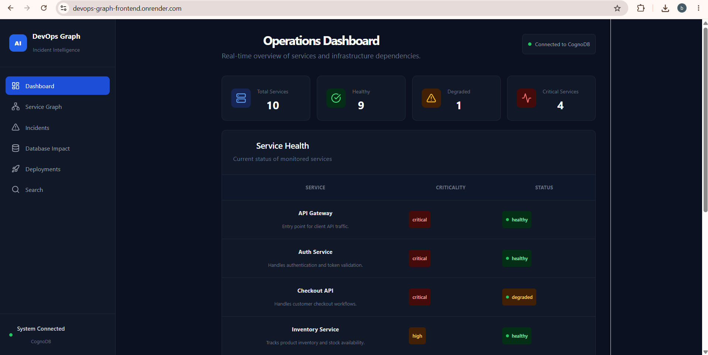
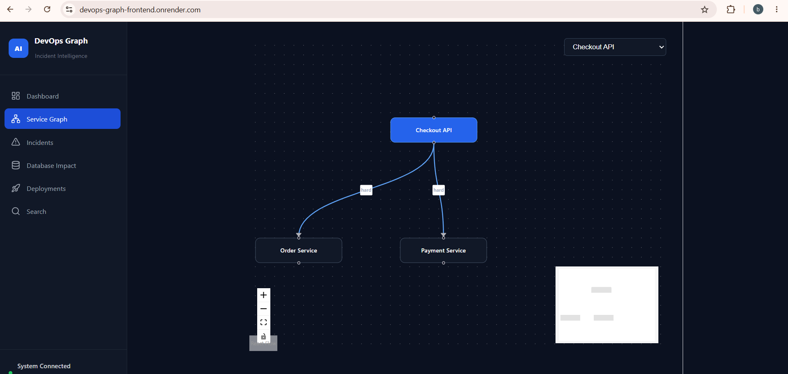
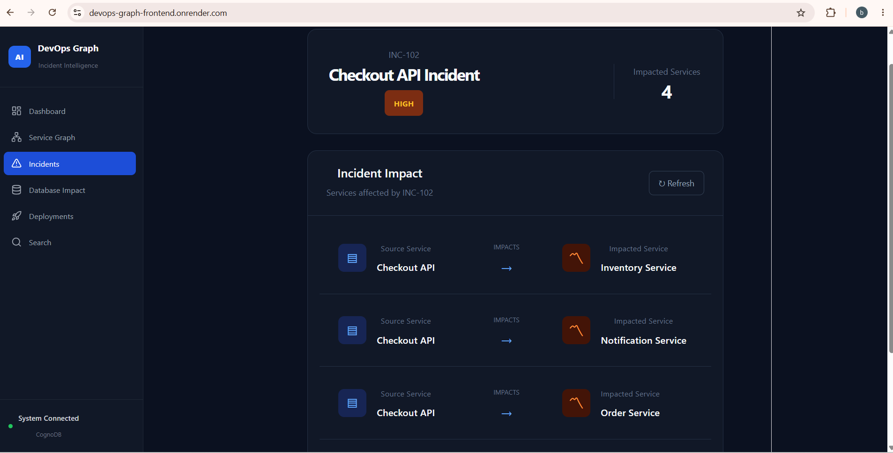
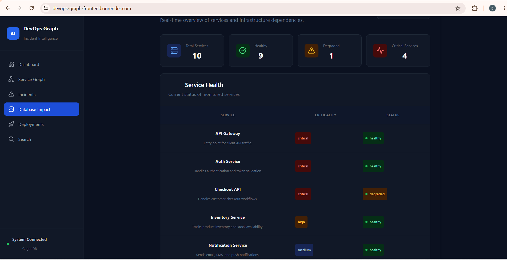
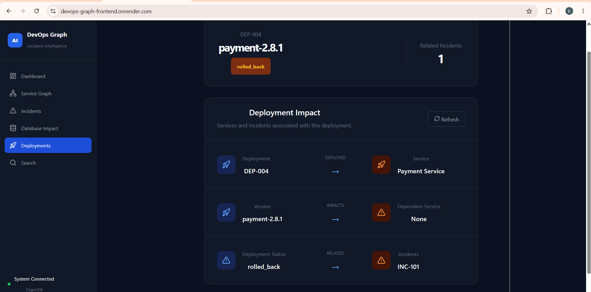
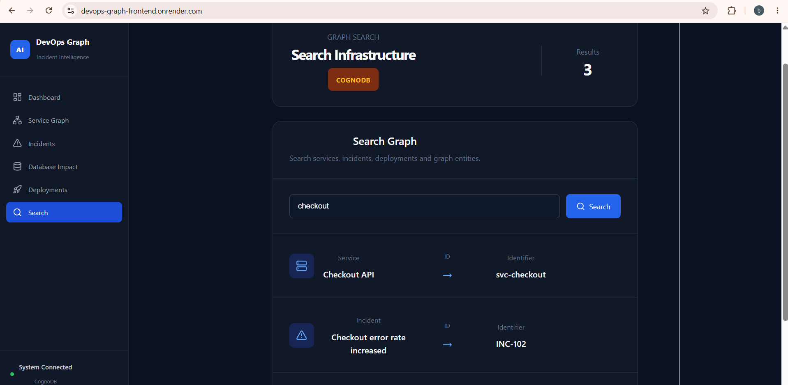

# DevOps Graph — Incident Intelligence

A full-stack graph database application for exploring service dependencies, incident impact, database blast radius, deployment impact, and infrastructure search.

Built for the Wexa AI CognoDB take-home assignment.

## Overview

DevOps systems contain highly connected entities: services depend on other services, services use databases, deployments affect services, and incidents propagate through dependency relationships.

This application models those relationships as a graph so an engineer can answer questions such as:

- Which services are affected by an incident?
- What is the downstream impact of a service failure?
- Which services are exposed if a database becomes unavailable?
- What services and incidents are associated with a deployment?
- Which graph entities match a service, incident, or deployment search?

## Technology Stack

- **Frontend:** React + Vite
- **Backend:** Python + FastAPI
- **Graph database:** CognoDB
- **Graph protocol:** openCypher over Bolt
- **Database driver:** official Neo4j Python driver
- **Graph visualization:** React Flow
- **API communication:** Axios

## Architecture

```text
                    ┌─────────────────────┐
                    │      React UI       │
                    │      Vite           │
                    └──────────┬──────────┘
                               │ REST
                               ▼
                    ┌─────────────────────┐
                    │      FastAPI        │
                    │   Service Layer     │
                    └──────────┬──────────┘
                               │
                         Neo4j Driver
                               │
                               ▼
                    ┌─────────────────────┐
                    │      CognoDB        │
                    │    Graph Database   │
                    └─────────────────────┘
```

## Why a Graph Database?

The core questions in this application are about **relationships and multi-hop connections**, rather than isolated records.

For example:

```text
Incident
   │
   └── AFFECTED ──> Checkout API
                       │
                       ├── DEPENDS_ON ──> Order Service
                       │                    │
                       │                    └── USES_DATABASE ──> Orders PostgreSQL
                       │
                       └── DEPENDS_ON ──> Payment Service
```

A graph model makes these traversals natural. The application can follow relationships across services, databases, deployments, and incidents without requiring large numbers of relational joins.

The assignment specifically asks for a graph model where relationships are meaningful and for multi-hop Cypher traversals.

## Graph Data Model

### Nodes

- `Service`
- `Incident`
- `Database`
- `Deployment`

### Relationships

- `(:Incident)-[:AFFECTED]->(:Service)`
- `(:Service)-[:DEPENDS_ON]->(:Service)`
- `(:Service)-[:USES_DATABASE]->(:Database)`
- `(:Deployment)-[:DEPLOYED]->(:Service)`
- `(:Incident)-[:CAUSED_BY]->(:Deployment)`

### Example Properties

**Service**
- `id`
- `name`
- `description`
- `criticality`
- `status`

**Incident**
- `id`
- `title`

**Database**
- `id`
- `name`

**Deployment**
- `id`
- `version`
- `status`

## Main Application Features

### 1. Operations Dashboard

Provides a high-level view of monitored services:

- Total services
- Healthy services
- Degraded services
- Critical services
- Service health table

### 2. Service Dependency Graph

Interactive React Flow visualization showing service relationships.

Example:

```text
Checkout API
    │
    ├── hard ──> Order Service
    │
    └── hard ──> Payment Service
```

### 3. Incident Impact

For an incident such as `INC-102`, the application traverses the graph to identify affected/downstream services.

Example result:

```text
INC-102
Checkout API
    ├── Inventory Service
    ├── Notification Service
    ├── Order Service
    └── Payment Service
```

### 4. Database Blast Radius

Identifies services directly using a database and dependent services that may be affected.

Example:

```text
Orders PostgreSQL
    │
    ├── Checkout API
    │      └── API Gateway
    │
    └── Order Service
           ├── API Gateway
           ├── Checkout API
           └── Shipping Service
```

### 5. Deployment Impact

Shows:

- Deployment
- Version
- Deployed service
- Dependent service
- Related incidents

Example:

```text
DEP-004
payment-2.8.1
      │
      └──> Payment Service
               │
               └── Related Incident: INC-101
```

### 6. Graph Search

Searches services, incidents, and deployments by name, ID, title, or version.

Example search:

```text
checkout
```

returns:

```text
Checkout API       svc-checkout
Checkout error...  INC-102
checkout-8.1.0     DEP-003
```

## API Endpoints

### Services

```text
GET /api/services
GET /api/services/{service_id}
GET /api/services/{service_id}/dependencies
```

### Graph Analysis

```text
GET /api/incidents/{incident_id}/impact
GET /api/databases/{database_id}/blast-radius
GET /api/deployments/{deployment_id}/impact
```

### Search

```text
GET /api/search?q={query}
```

## Example Queries

### Incident multi-hop impact

The incident analysis traverses:

```cypher
MATCH (i:Incident {id: $incident_id})
      -[:AFFECTED]->
      (affected:Service)

OPTIONAL MATCH
      (affected)-[:DEPENDS_ON*1..3]->
      (downstream:Service)
```

This is a multi-hop graph traversal.

### Database blast radius

The database analysis follows:

```cypher
MATCH (db:Database {id: $database_id})
      <-[:USES_DATABASE]-
      (direct:Service)

OPTIONAL MATCH
      (dependent:Service)
      -[:DEPENDS_ON*1..3]->
      (direct)
```

### Search

The search query checks multiple graph entity types and properties using a parameterized search term.

All application queries use parameters rather than string-concatenated Cypher.

## Local Setup

### Prerequisites

- Python 3.11+
- Node.js
- npm
- A CognoDB Cloud instance

### 1. Clone

```bash
git clone https://github.com/Bhuvaneshwar24/devops-graph
cd ai-devops-graph
```

### 2. Backend

```powershell
cd backend
python -m venv .venv
.\.venv\Scripts\Activate.ps1
pip install -r requirements.txt
```

Create a `.env` file containing the CognoDB connection details expected by `app/database.py`.

Do not commit secrets.

Start the API:

```powershell
python -m uvicorn app.main:app --reload
```

The local API runs at:

```text
http://127.0.0.1:8000
```

### 3. Frontend

Open another terminal:

```powershell
cd frontend
npm install
npm run dev
```

The Vite development server runs at:

```text
http://localhost:5173
```

## Production Build

```powershell
cd frontend
npm run build
```

The production output is generated in:

```text
frontend/dist/
```

## Environment Variables

Secrets must never be committed.

Example:

```text
COGNODB_URI=<your-cognodb-bolt-uri>
COGNODB_USERNAME=cognodb
COGNODB_PASSWORD=<your-password>
```

Use the exact variable names expected by the backend configuration.

For the hosted frontend, configure the API base URL through a Vite environment variable rather than hard-coding localhost.

Example:

```text
VITE_API_BASE_URL=https://devops-graph.onrender.com
```

## Deployment

The application can be deployed as two services:

Render Static Site
  │
  │ HTTPS REST API
  ▼
Render Web Service
  │
  │ Bolt
  ▼
CognoDB Cloud```

### Backend

Deploy the `backend` directory as a Python Web Service.

Build command:

```text
pip install -r requirements.txt
```

Start command:

```text
uvicorn app.main:app --host 0.0.0.0 --port $PORT
```

Configure the CognoDB environment variables in the hosting provider's secret/environment settings.

### Frontend

Deploy the `frontend` directory as a Vite/React application.

Build command:

```text
npm run build
```

Output directory:

```text
dist
```

Set:

```text
VITE_API_BASE_URL=https://devops-graph.onrender.com
```

## Security

- CognoDB credentials are stored in environment variables.
- Secrets are excluded from Git.
- Production frontend must use the public backend URL instead of localhost.
- Backend CORS should allow the deployed frontend origin.

## Project Structure

```text
.
├── backend/
│   ├── app/
│   │   ├── routes/
│   │   ├── services/
│   │   ├── database.py
│   │   └── main.py
│   ├── requirements.txt
│   └── ...
│
├── frontend/
│   ├── src/
│   │   ├── components/
│   │   ├── pages/
│   │   ├── services/
│   │   └── ...
│   ├── package.json
│   └── ...
│
└── README.md
```

## Screenshots

### Operations Dashboard



### Service Dependency Graph



### Incident Impact



### Database Blast Radius



### Deployment Impact



### Graph Search

## Assessment Notes

This project was created as a full-stack graph database application for the Wexa AI CognoDB take-home assignment.

The application focuses on a real-world DevOps incident intelligence use case where graph relationships provide the primary value.

The project does **not** claim an AI/ML component; the use case is intentionally focused on graph-based infrastructure and incident analysis.

## Submission

Repository:

```text
https://github.com/Bhuvaneshwar24/devops-graph
```

Hosted demo:

```text
https://devops-graph-frontend.onrender.com
```

Screen recording:

```text
No screen recording included
```
